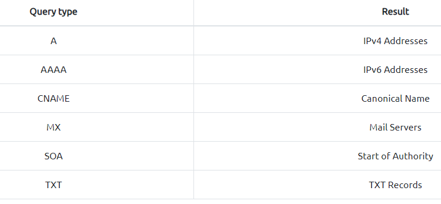

# Recon(Reconnaissance) # 
## 1. Passive Reconnaissance
### commmand: ###   
```
whois domain.com

nslookup domain.com
nslookup -type=A domain.com 1.1.1.1
nslookup -type=a domain.com 1.1.1.1 

dig domain.com 
dig domain.com MX  
dig @1.1.1.1 domain.com MX
```
>[public DNS servers](https://duckduckgo.com/?q=public+dns) 




### DNSDumpster ###    

* [https://dnsdumpster.com/](https://dnsdumpster.com/)  

### shodan ### 

* [https://www.shodan.io/](https://www.shodan.io/) 
* [Search Query Fundamentals](https://help.shodan.io/the-basics/search-query-fundamentals) 

## 2. Active Reconnaissance
### web browser 
  (1) Add a port to the address egg:https://127.0.0.1:8834/ will connect to 127.0.0.1 (localhost) at port 8834 via HTTPS protocol.   
  (2) Developer Tools  
  (3) add-ons    
* FoxyProxy
* [User-Agent Switcher and Manager](https://addons.mozilla.org/en-US/firefox/addon/user-agent-string-switcher) 
* Wappalyzer
### ping 
```
ping ipaddress
ping hostname
ping -n ipaddress //windows
ping -c ipaddress //linux
```
### traceroute
>The purpose of a traceroute is to find the IP addresses of the routers or hops that a packet traverses as it goes from your system to a target host
```
traceroute domain.com //linux
tracert domain.com //windows

```
### telnet 
```
telnet ipaddress port
GET / HTTP/1.1
host: telnet
```
### netcat 
```
nc ipaddress port //client
nc -lvnp port//server
```
*tip: Write a shell script and put them all together*